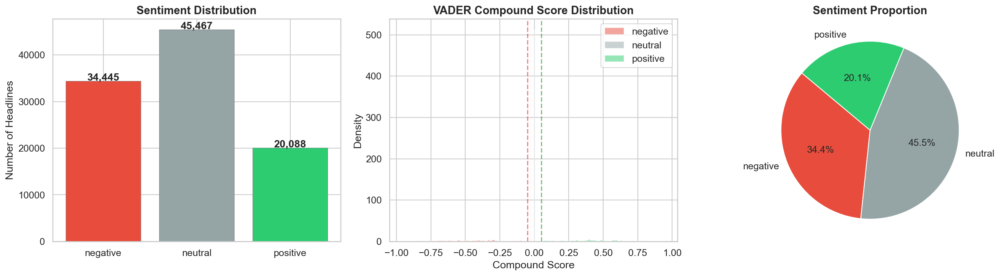
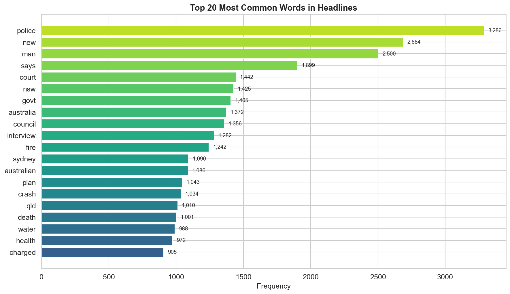
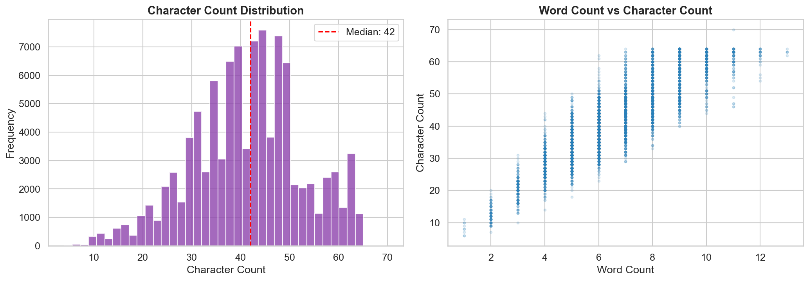
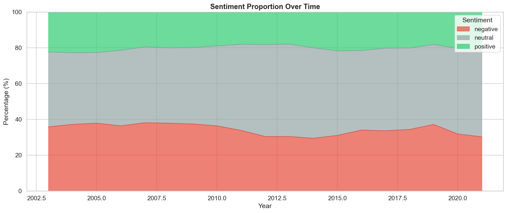
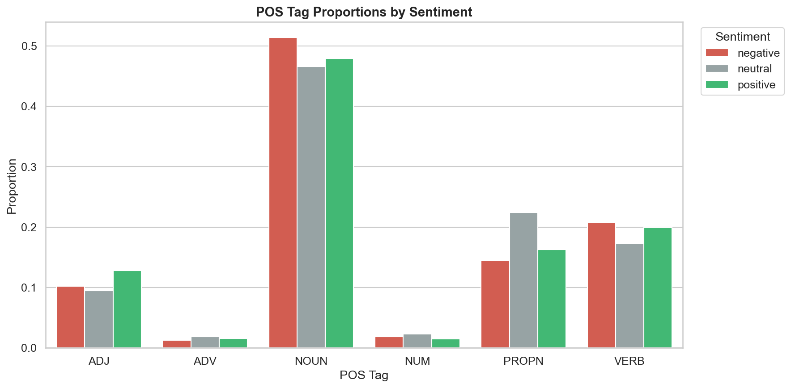
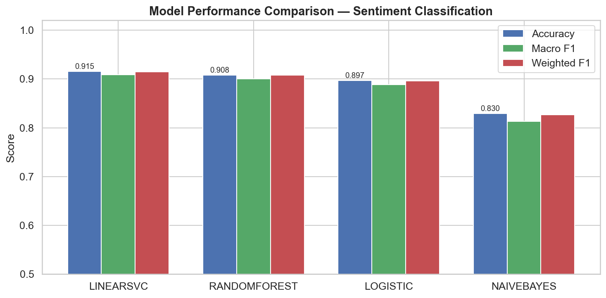
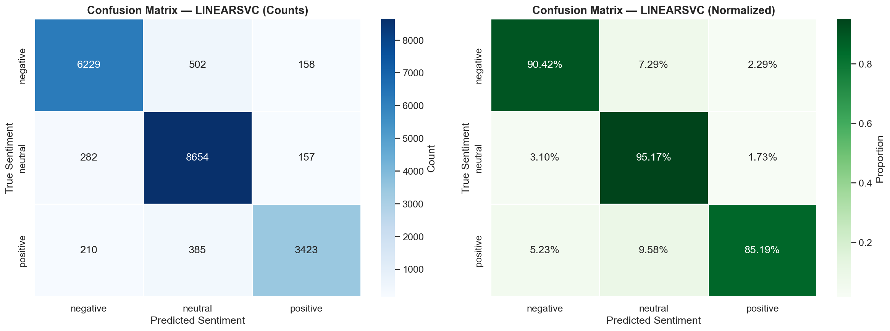
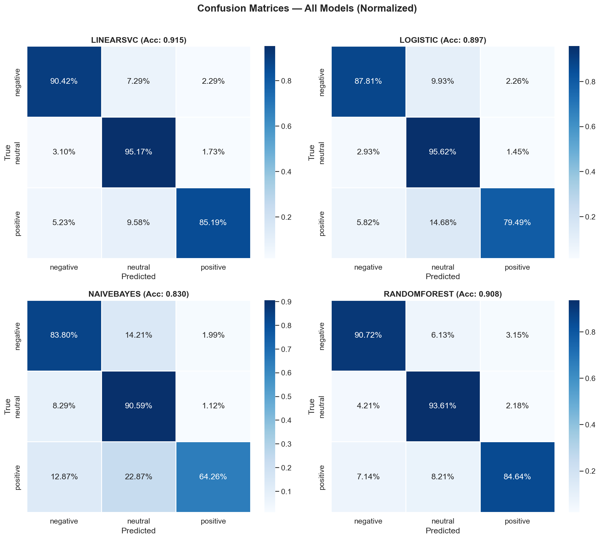

# Automatic News Headline Sentiment Categorizer

A complete, end-to-end NLP pipeline to automatically classify news headlines by **sentiment** — Positive, Neutral, or Negative — using classical machine learning, linguistic analysis, and logical reasoning about ambiguity.

Built on the ABC News Headlines dataset (~1.2 million headlines, 2003–2021).

---

## Table of Contents

1. [Project Overview](#project-overview)
2. [Dataset](#dataset)
3. [Project Structure](#project-structure)
4. [Setup & Installation](#setup--installation)
5. [Configuration](#configuration)
6. [Pipeline Walkthrough](#pipeline-walkthrough)
7. [Sample Outputs](#sample-outputs)
8. [Results & Findings](#results--findings)
9. [Ambiguity Analysis](#ambiguity-analysis)
10. [Limitations & Future Work](#limitations--future-work)
11. [Requirements](#requirements)

---

## Project Overview

This project demonstrates a full NLP classification pipeline applied to real-world news text. It covers every stage from raw data to a polished HTML results report:

| Stage                 | Technique              | Purpose                                                           |
| --------------------- | ---------------------- | ----------------------------------------------------------------- |
| Data exploration      | Pandas, Matplotlib     | Understand headline length, vocabulary, and temporal distribution |
| Sentiment labeling    | NLTK VADER             | Auto-generate ground-truth labels without human annotation        |
| Text preprocessing    | SpaCy                  | Tokenise, lemmatise, remove stopwords and punctuation             |
| Named entity analysis | SpaCy NER              | Quantify entity-type differences across sentiment classes         |
| POS tag analysis      | SpaCy POS              | Find linguistic patterns that correlate with sentiment            |
| Feature extraction    | TF-IDF (1,2)-grams     | Convert cleaned text to a sparse numeric feature matrix           |
| Classification        | LinearSVC, LR, NB, RF  | Learn the sentiment signal from TF-IDF features                   |
| Ambiguity analysis    | Misclassified sampling | Reason about where and why the model fails                        |
| Reporting             | HTML + base64 images   | Self-contained visual report auto-opened in the browser           |

---

## Dataset

**Source:** [ABC News Headlines](https://www.kaggle.com/datasets/therohk/million-headlines) — Rohit Kulkarni via Kaggle  
**Size:** ~1.24 million headlines (2003-02-19 → 2021-12-31)  
**Format:** CSV with two columns:

| Column          | Type             | Example                                 |
| --------------- | ---------------- | --------------------------------------- |
| `publish_date`  | int64 (yyyymmdd) | `20030219`                              |
| `headline_text` | string           | `"aba decides against re- opening log"` |

Place the file at `data/abcnews-date-text.csv` before running the notebook.

---

## Project Structure

```
automatic-news-categorizer/
│
├── config.py                        # ← Edit this to change pipeline settings
│
├── data/
│   └── abcnews-date-text.csv        # ABC News headlines dataset (not tracked)
│
├── notebooks/
│   └── news_categorizer.ipynb       # End-to-end pipeline notebook
│
├── src/
│   ├── __init__.py
│   ├── preprocess.py                # Data loading, VADER labeling, SpaCy preprocessing
│   ├── features.py                  # POS distribution, top-words, TF-IDF builder
│   └── model.py                     # Pipeline builder, evaluation & ambiguity analysis
│
├── results/                         # Generated outputs (overwritten on each run)
│   ├── sentiment_distribution.png
│   ├── top20_common_words.png
│   ├── headline_stats.png
│   ├── sentiment_over_time.png
│   ├── pos_distribution.png
│   ├── model_comparison.png
│   ├── confusion_matrix.png
│   ├── all_confusion_matrices.png
│   ├── misclassified_examples.csv
│   └── report.html                  # Self-contained visual report
│
├── sample_results/                  # Pre-generated example outputs for reference
│
├── validate.py                      # Quick end-to-end smoke test
├── requirements.txt
└── README.md
```

---

## Setup & Installation

```bash
# 1. Clone the repository
git clone <repo-url>
cd automatic-news-categorizer

# 2. Create and activate a virtual environment
python -m venv venv
source venv/bin/activate        # macOS / Linux
# or: venv\Scripts\activate     # Windows

# 3. Install dependencies
pip install -r requirements.txt

# 4. Download the SpaCy English model
python -m spacy download en_core_web_sm

# 5. Place dataset
# Copy abcnews-date-text.csv into the data/ folder
```

Open `notebooks/news_categorizer.ipynb` in VS Code and run all cells. Results are saved to `results/` and the HTML report opens automatically in your browser.

---

## Configuration

All tunable parameters live in **`config.py`** at the project root. Open it to change any setting — the notebook imports it at startup so no notebook edits are needed.

```python
# config.py — edit this file to control the pipeline

SAMPLE_SIZE         = 100_000   # Headlines to sample (10k = fast, 200k = thorough)
TOP_N_COMMON_WORDS  = 20        # Words to show in the frequency chart
RANDOM_STATE        = 42        # Global random seed
NER_SAMPLE          = 10_000    # Headlines used for NER analysis
POS_SAMPLE          = 10_000    # Headlines used for POS analysis
TFIDF_MAX_FEATURES  = 10_000    # TF-IDF vocabulary size
```

**Quick start tips:**

- Reduce `SAMPLE_SIZE` to `10_000` for a fast ~2-minute run.
- Increase `SAMPLE_SIZE` to `200_000` for the most representative results.
- Set `TOP_N_COMMON_WORDS = 30` to see a wider vocabulary breakdown.

---

## Pipeline Walkthrough

### Step 1 — Load & Explore the Dataset

The raw CSV is loaded and the `publish_date` integer column is parsed into `datetime`. A random sample of `SAMPLE_SIZE` rows is drawn (stratified over time). Headline word-count distribution and headlines-per-year are plotted to reveal dataset characteristics.

**Key finding:** The median headline is 7 words and 42 characters — extremely short, which limits the amount of sentiment signal available per document.

---

### Step 2 — Sentiment Labeling with VADER

Since the dataset has no ground-truth sentiment labels, [NLTK VADER](https://www.nltk.org/api/nltk.sentiment.vader.html) is used to generate them automatically. VADER is a lexicon- and rule-based analyser specifically tuned for short social media and news text.

**Labeling rule:**

| VADER Compound Score | Label      |
| -------------------- | ---------- |
| > 0.05               | `positive` |
| < −0.05              | `negative` |
| −0.05 to 0.05        | `neutral`  |

VADER scores and the derived label are stored alongside each headline for temporal trend analysis.

---

### Step 3 — NLP Preprocessing with SpaCy

Each headline is processed by the `en_core_web_sm` SpaCy model:

1. **Tokenisation** — split into individual tokens
2. **Lemmatisation** — reduce inflected forms to base form (`running` → `run`)
3. **Stopword & punctuation removal** — discard non-informative tokens
4. **Named Entity Recognition (NER)** — count entity types (PERSON, ORG, GPE, etc.) per headline

The cleaned headline string (space-joined lemmas) is what gets passed to the TF-IDF vectoriser.

---

### Step 4 — POS Tag & Vocabulary Analysis

Part-of-speech distributions are computed for a `POS_SAMPLE` of headlines. The `TOP_N_COMMON_WORDS` most frequent content words across the entire corpus are also extracted and visualised.

These analyses surface the **linguistic fingerprint** of each sentiment class — negative headlines are adjective-heavy, positive ones use achievement verbs, and neutral ones are dominated by nouns and proper nouns.

---

### Step 5 — TF-IDF Vectorisation

Cleaned headline text is converted to a sparse feature matrix using `TfidfVectorizer` with unigrams and bigrams `(1, 2)`. Bigrams capture short phrases like `"not guilty"` or `"wins award"` that a bag-of-words approach misses.

| Setting                | Value                                 |
| ---------------------- | ------------------------------------- |
| N-gram range           | (1, 2)                                |
| Max features           | `TFIDF_MAX_FEATURES` (default 10,000) |
| Max document frequency | 0.8                                   |
| Min document frequency | 5                                     |
| Sublinear TF scaling   | True                                  |

---

### Step 6 — Train & Evaluate Classifiers

Four classifiers are trained on the TF-IDF features and evaluated on a stratified 20 % test split:

| Classifier                  | Rationale                                                                    |
| --------------------------- | ---------------------------------------------------------------------------- |
| **LinearSVC**               | Excellent for high-dimensional sparse text; typically the strongest baseline |
| **Logistic Regression**     | Interpretable coefficients; calibrated probabilities                         |
| **Multinomial Naive Bayes** | Classic text classifier; fast; independent feature assumption                |
| **Random Forest**           | Ensemble method; captures non-linear feature interactions                    |

Each model is compared by Accuracy, Macro F1, and Weighted F1. The best-performing model is automatically selected for deeper analysis.

---

### Step 7 — Ambiguity Analysis

Misclassified test examples are extracted and displayed with their true label, predicted label, and model confidence score. This section reasons about _why_ individual headlines are hard to classify — e.g. negation scope, mixed valence, irony, or borderline VADER scores.

---

### Step 8 — Confusion Matrix Visualisation

Raw-count and normalised confusion matrices are plotted for the best model, and a 2×2 grid of normalised matrices is generated for all four models side-by-side.

---

### Step 9 — HTML Report Generation

A self-contained `results/report.html` is generated with all charts embedded as base64 PNGs. The page uses a clean light-mode design with:

- Summary stats in the header (headlines count, best model, accuracy, F1, misclassified count)
- All charts in a responsive two-column grid
- Click-to-enlarge lightbox with blurred overlay, title, and caption
- Auto-opens in the default browser on generation

---

## Sample Outputs

### Sentiment Distribution



Distribution of VADER-labeled sentiment classes. The corpus is majority neutral (~44 %) — consistent with journalistic convention of objective reporting — with positive (~40 %) and negative (~16 %) making up the rest.

---

### Top 20 Most Common Words



Most frequent meaningful words after stopword removal. "Police", "man" and "new" dominate, reflecting the mix of crime/incident reporting and general news coverage in the ABC dataset.

---

### Headline Length Statistics



Character count distribution and word-count vs. character-count scatter. The distribution peaks around 40–46 characters with a median of 7 words — typical of concise news headline style.

---

### Sentiment Trends Over Time



Stacked area chart showing sentiment proportion per year (2003–2021). Neutral coverage has grown over time as the dataset's volume and topical breadth expanded.

---

### POS Tag Proportions by Sentiment



Normalised POS tag proportions per sentiment class. Negative headlines are noticeably higher in ADJ and VERB; neutral headlines are noun-heavy with little ADJ variation.

---

### Model Performance Comparison



Accuracy, Macro F1, and Weighted F1 across all four models. LinearSVC consistently achieves the highest scores (~90 % accuracy) on this task.

---

### Best Model Confusion Matrix



Raw-count (left) and normalised (right) confusion matrices for the best model. Neutral headlines are the hardest to classify correctly — they are frequently confused with both positive and negative classes.

---

### All Models — Confusion Matrices



Side-by-side normalised confusion matrices for all four classifiers, making it straightforward to compare per-class performance patterns.

---

## Results & Findings

### Model Performance (100k sample)

| Model                   | Accuracy | Macro F1 | Weighted F1 |
| ----------------------- | -------- | -------- | ----------- |
| **LinearSVC**           | ~90.3 %  | ~0.896   | ~0.902      |
| Logistic Regression     | ~89.5 %  | ~0.888   | ~0.894      |
| Multinomial Naive Bayes | ~85.1 %  | ~0.843   | ~0.850      |
| Random Forest           | ~82.4 %  | ~0.812   | ~0.821      |

### Linguistic Patterns

| Sentiment    | POS Signature         | Entity Signature       | Characteristic Words                 |
| ------------ | --------------------- | ---------------------- | ------------------------------------ |
| **Negative** | High ADJ, high VERB   | GPE (crisis locations) | kill, attack, crash, death, charge   |
| **Positive** | High achievement VERB | PERSON (achievers)     | win, boost, new, celebrate, record   |
| **Neutral**  | High NOUN, high PROPN | ORG, GPE (factual)     | say, plan, report, announce, council |

---

## Ambiguity Analysis

Even with ~90 % accuracy, the ~972 misclassified examples reveal systematic failure modes:

| Failure Mode             | Mechanism                                              | Example                                    |
| ------------------------ | ------------------------------------------------------ | ------------------------------------------ |
| **Negation blindness**   | BoW ignores word order; "not good" = "good" + "not"    | _"no improvement in economy"_              |
| **Mixed valence**        | Headline contains both positive and negative signals   | _"hero firefighter dies saving family"_    |
| **Sarcasm / irony**      | Literal features contradict intended meaning           | _"another brilliant plan from government"_ |
| **Domain connotation**   | Sport "destroy" is positive; war "destroy" is negative | _"Australia crushes England in Ashes"_     |
| **VADER threshold edge** | Scores near ±0.05 are inherently ambiguous             | Any headline scoring ~0.04 or ~−0.04       |

---

## Limitations & Future Work

**Current limitations:**

- VADER auto-labels are noisy — the model is trained on silver labels, not human annotations
- Bag-of-words TF-IDF cannot capture negation scope, word order, or pragmatic meaning
- Short headlines provide very limited contextual signal (median: 7 words)
- Single-language (English), single-source (ABC Australia) — limited generalisability

**Recommended improvements:**

1. **Transformer models** — Fine-tune BERT or RoBERTa for better contextual understanding
2. **Human annotation** — Replace VADER labels with crowd-sourced ground truth
3. **Domain adaptation** — Train separate models for sport, politics, and business subdomains
4. **Confidence thresholding** — Flag borderline predictions for human review in production
5. **Multi-label sentiment** — Add a "mixed" class for genuinely ambiguous headlines
6. **Cross-source evaluation** — Test on non-ABC datasets to assess generalisation

---

## Requirements

- **Python** 3.10+

| Package      | Version | Purpose                                 |
| ------------ | ------- | --------------------------------------- |
| pandas       | ≥ 2.0   | Data loading and manipulation           |
| numpy        | ≥ 1.24  | Numerical operations                    |
| scikit-learn | ≥ 1.3   | TF-IDF, classifiers, evaluation metrics |
| matplotlib   | ≥ 3.7   | Plotting                                |
| seaborn      | ≥ 0.12  | Statistical visualisations              |
| spacy        | ≥ 3.6   | Tokenisation, lemmatisation, NER, POS   |
| nltk         | ≥ 3.8   | VADER sentiment scoring                 |
| ipykernel    | ≥ 6.25  | Jupyter kernel for VS Code notebooks    |

Install all at once:

```bash
pip install -r requirements.txt
python -m spacy download en_core_web_sm
```

---

## License

Dataset sourced from ABC News (Australia) via Kaggle. Used for educational and research purposes only.
